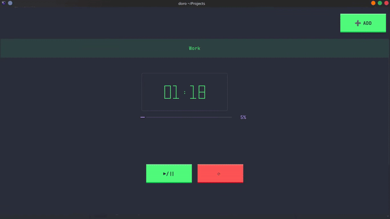
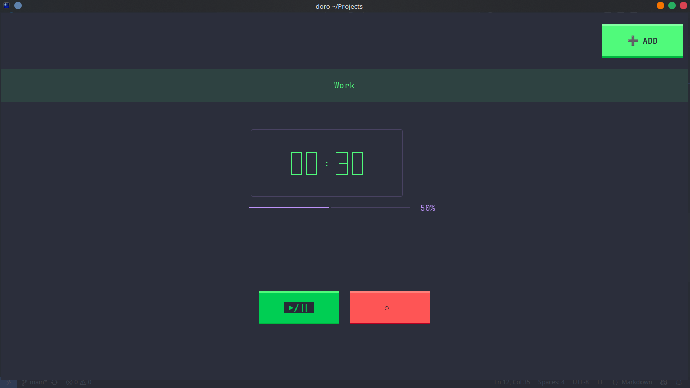
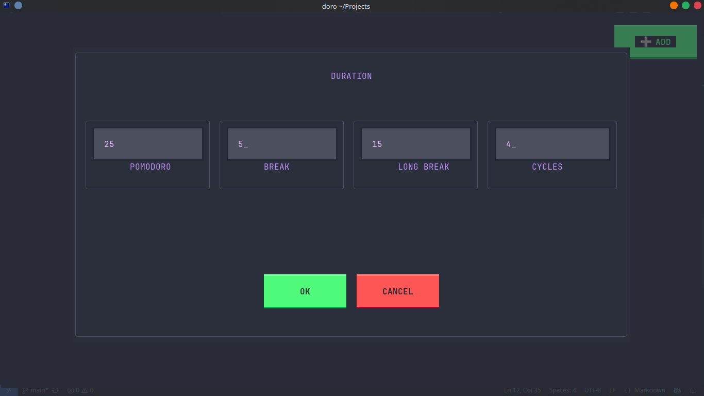
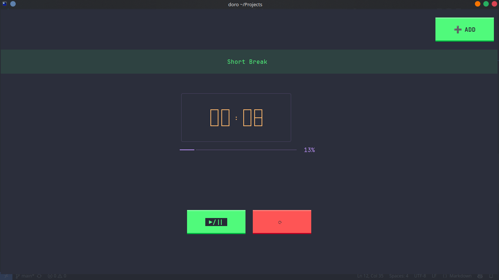
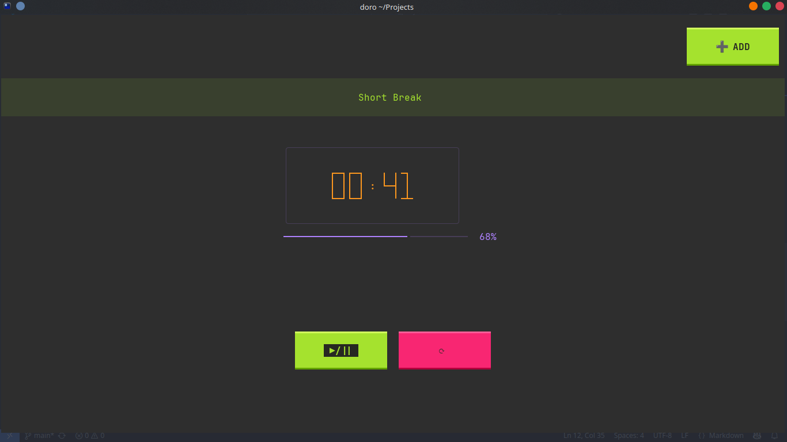

<h1 align="center">Doro 🕰️</h1>

<div align="center">

<a href="https://github.com/Balaji01-4D/doro/stargazers"></a>
<a href="https://github.com/Balaji01-4D/doro/network/members"></a>
<a href="https://github.com/Balaji01-4D/doro/pulls"></a>
<a href="https://github.com/Balaji01-4D/doro/issues"></a>
<a href="https://github.com/Balaji01-4D/doro/graphs/contributors"></a>
<a href="https://github.com/Balaji01-4D/doro/blob/master/LICENSE"></a>



<i>Loved the project? Please consider <a href="https://ko-fi.com/balaji01">donating</a> to help it improve!</i>

</div>

# 🕰️ Doro — Minimal & Colorful CLI Pomodoro Timer

Welcome to **Doro**! A modern, vibrant, and distraction-free Pomodoro timer for your terminal, built with Python. Boost your productivity with style! ✨

---

## 🚀 Features
- 🎨 **Colorful, modern CLI** — Enjoy a visually pleasing experience
- ⏲️ **Customizable Pomodoro & break durations**
- 🔔 **Visual & sound notifications** (if supported)
- ⚡ **Lightweight & fast**
- 🐧 **Works on Linux, macOS, and Windows**

> **Note:** If you don't hear the bell sound notifications, you may need to configure your terminal's bell sound settings. Most modern terminals allow this in their preferences or settings menu.

---

## 📦 Installation

Clone the repository:

```sh
git clone https://github.com/Balaji01-4D/doro
cd doro_project
```

Install dependencies:

```sh
pip install -r requirements.txt
```

---

## 🛠️ Usage

Start your Pomodoro session from the terminal:

```sh
python -m doro.main
```

Or, if you have an entry point script:

```sh
python doro/main.py
```

### Command-line Arguments

Customize your Pomodoro experience with these command-line options:

```sh
# Display version information
python -m doro.main --version

# Set custom pomodoro duration (in minutes)
python -m doro.main --pomodoro 30

# Set custom short break duration (in minutes)
python -m doro.main --short-break 8

# Set custom long break duration (in minutes)
python -m doro.main --long-break 20

# Set number of cycles before a long break
python -m doro.main --cycles 4

# Set application theme (options: dracula, monokai, github_dark, github_light)
python -m doro.main --theme monokai

# Combine multiple options
python -m doro.main --pomodoro 30 --short-break 8 --long-break 20 --cycles 4 --theme dracula
```

Follow the on-screen instructions and enjoy your focused work session! 💪

---

## 📸 Screenshots

<p align="center">
  
  
</p>

<p align="center">
  <b>Main Timer Interface</b> &nbsp;&nbsp;&nbsp;&nbsp;&nbsp;&nbsp;&nbsp;&nbsp;&nbsp;&nbsp;&nbsp;&nbsp;&nbsp;&nbsp;&nbsp;&nbsp; <b>Custom Duration Settings</b>
</p>

<p align="center">
  
  
</p>

<p align="center">
  <b>Short Break - Default Theme</b> &nbsp;&nbsp;&nbsp;&nbsp;&nbsp; <b>Short Break - Monokai Theme</b>
</p>

---

## 🎛️ Customization
- Adjust Pomodoro and break durations via settings or command-line arguments (if supported)
- Explore the `doro/` directory for configuration options

---

## 🤝 Contributing
Pull requests are welcome! For major changes, please open an issue first to discuss what you would like to change.

---

## 📄 License
MIT License — free for personal & commercial use.

---

> Made with ❤️ for productivity!
